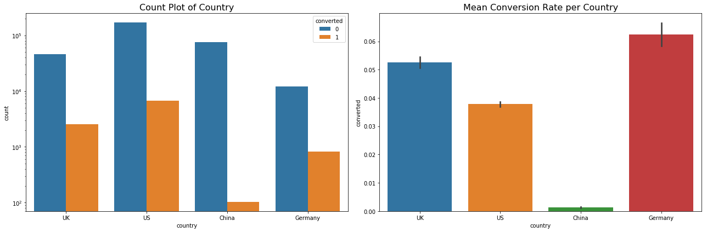

# histogram 
## multiple histograms in one plot
```python
import seaborn as sns
import matplotlib.pyplot as plt
hist_kws={'histtype': 'bar', 'edgecolor':'black', 'alpha': 0.2}
fig, ax = plt.subplots(figsize=(18,6))
sns.distplot(pd.series1, label = 'label_name1', hist_kws=hist_kws, ax=ax)
sns.distplot(pd.series2, label = 'label_name2', hist_kws=hist_kws, ax=ax)
ax.set_title('title')
ax.legend()
```
### example
```python
import seaborn as sns
import matplotlib.pyplot as plt
hist_kws={'histtype': 'bar', 'edgecolor':'black', 'alpha': 0.2}
fig, ax = plt.subplots(figsize=(18,6))
mask0 = data['test'] == 0
mask1 = data['test'] == 1
sns.distplot(data[mask0]['age'], label = 'control', 
    hist_kws=hist_kws, ax=ax)
sns.distplot(data[mask1]['age'], label = 'test',
    hist_kws=hist_kws, ax=ax)
ax.set_title('count bar of age')
ax.legend()
```

## two plots in a row
### example
```python
# Visualization of different sources
grouped = data[['age', 'converted']].groupby('age').mean().reset_index()
hist_kws={'histtype': 'bar', 'edgecolor':'black', 'alpha': 0.2}

fig, ax = plt.subplots(nrows=1, ncols=2, figsize=(18, 6))
sns.distplot(data[data['converted'] == 0]['age'], label='Converted 0', 
             ax=ax[0], hist_kws=hist_kws)
sns.distplot(data[data['converted'] == 1]['age'], label='Converted 1', 
             ax=ax[0], hist_kws=hist_kws)
ax[0].set_title('Count Plot of Age', fontsize=16)
ax[0].legend()
ax[1].plot(grouped['age'], grouped['converted'], '.-')
ax[1].set_title('Mean Conversion Rate vs. Age', fontsize=16)
ax[1].set_xlabel('age')
ax[1].set_ylabel('Mean convertion rate')
ax[1].grid(True)
plt.show()
```

# counter plot and bar plot example
**By default**, _barplot_ will use the mean values of y on the group x
```python
fig, ax = plt.subplots(nrows=1, ncols=2, figsize=(18, 6))
sns.countplot(x='country', hue='converted', data=data, ax=ax[0])
ax[0].set_title('Count Plot of Country', fontsize=16)
ax[0].set_yscale('log')
sns.barplot(x='country', y='converted', data=data, ax=ax[1])
ax[1].set_title('Mean Conversion Rate per Country', fontsize=16)
plt.tight_layout()
plt.show()
```




# two plots in one plot
## set_yscale
```python
fig, ax = plt.subplots(figsize=(10, 8))
ax.plot(x1, y1, label='label1')
ax.plot(x2, y2, label='label2')
ax.set_xlabel('x axis label', fontsize=12)
ax.set_ylabel('y axis label', fontsize=12)
ax.set_yscale('log')
ax.legend(fontsize=12)
plt.show()
```